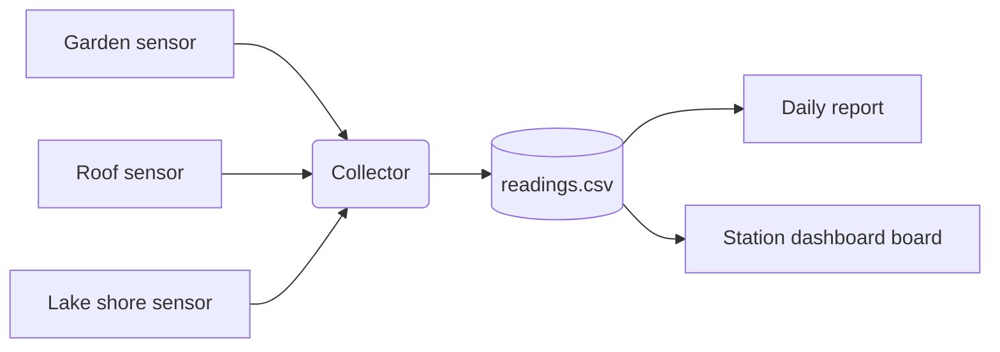

# Architecture

Each station is a small board with a sensor and Wi-Fi. The collector polls every station once an
hour and appends one row per station to `data/readings.csv`.

## Decisions

- **CSV, not a database.** One file is easy to inspect, diff and open as a grid.
- **Pull, not push.** Stations stay simple: they only answer `GET /now`.
- **A board for the dashboard.** It lives next to the data, so the project carries its own tools.
